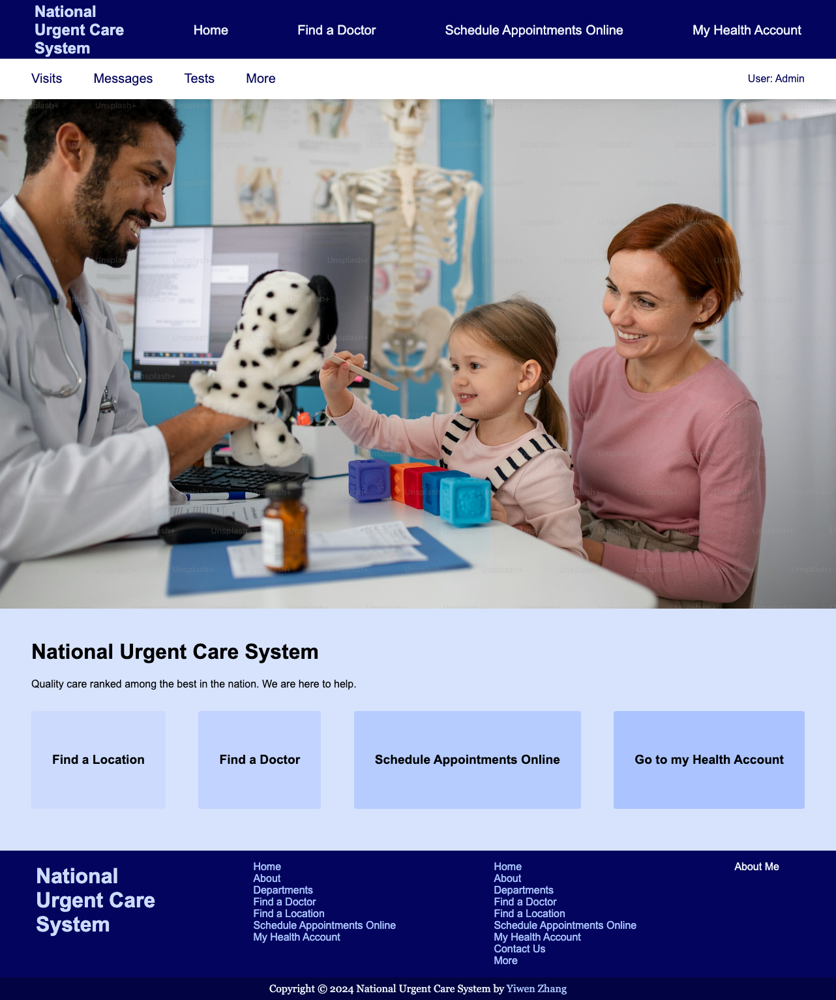
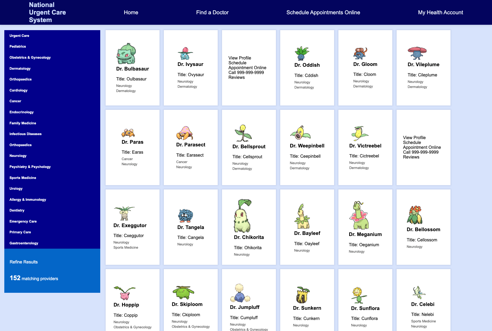
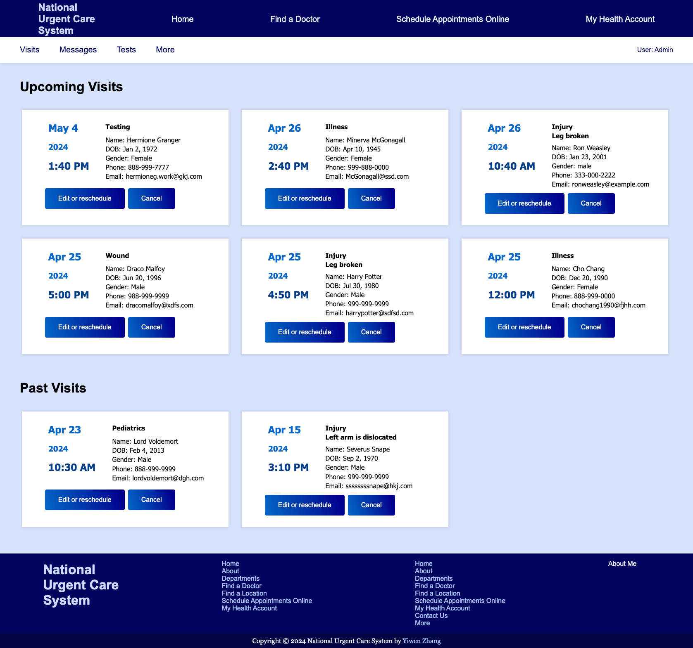

# Urgent Care Hub - Fullstack CRUD Operations with visit scheduling and management

## Description

The Urgent Care Hub is a full-stack React web application designed to schedule appointments and manage visits for an urgent care facility. It provides functionality for creating, editing, and deleting patient visits, as well as viewing details of each visit.

This is a full-stack web application built using the MERN stack (MongoDB, Express.js, React.js, Node.js). The backend communicates with the MongoDB database to store and retrieve data. On the frontend, React.js is utilized to create an interactive user interface to schedule appointments and manage visits, as well as to search and browse a directory of doctors and healthcare providers.

## Table of Contents

- [Technologies Used](#technologies-used)
- [Concept](#concept)
- [Features](#features)
- [Database](#database)
- [Deployment](#deployment)
- [Code Sample](#code-sample)

## Technologies Used

- **Frontend**:
  HTML | CSS | JavaScript | React | React Router | Redux (for managing application state) | Axios | Pokemon API

- **Backend**:
  JavaScript | MongoDB | Express | Node.js | Mongoose | Axios

## Concept

One day, the thought crossed my mind: I wish I could use an urgent care facility which I could always access my medical records no matter where I go in the nation.  
Perhaps I relocate and don't have a family doctor yet.  
Perhaps I travel around the country.  
I may travel to some locations on business trips.  
Alternatively, I might visit my family, relatives and friends in different locations.

## Features

### Landing Page



### Find-A-Doctor Page

- Display list of doctors/providers.
- Search and refine results based on different departments.
- View detailed information for each provider.
- The doctor card is featured as a flip card with basic information on the front side, and more information on the back side.
- The total number of refined results is shown on the left side for each department.
- The Pokemon API is used to generate doctor card list as a demo.



### Schedule Page

- **Add Visit**: Users can easily schedule new patient appointments online, providing details such as date, time, patient information, and reason(s) for visit.
- This form connects to the backend MongoDB database.
- The real-time local time is shown in the page as a reference for the user to schedule an appointment online.


### Account Page

- **Edit Visit**: Existing visits can be edited or re-scheduled, allowing updates to patient information or visit details.
- **Delete Visit**: Users can cancel the visits, that is, removing visits from the system.
- **View Visit as filtered and sorted**: The visits are filtered into upcoming visits and past visits; and visits are sorted by date and time in both sections.
- **View Visit Details**: Detailed information for each visit can be viewed, including date, time, patient details and reason(s) for visit.
- Users can also navigate to different sections via user header in their accounts.

#### All scheduled visits listed:



#### Edit Form:


### Other Features:

- **Responsive Design**: The application is designed to be responsive, providing a seamless experience across various size of browsers.
- **Error Handling and Validation**: Incorporates error handling and validation mechanisms to ensure data integrity and provide a smooth user experience, with informative error messages and input validation.
- The application includes a navigation bar for easy access to different sections.
- The application includes a footer with side maps for easy access to different sections.

## Database


#### Data Example

```
[
  {
    "_id": "662807dbf6fe854d787020a7",
    "date": "2024-04-15T00:00:00.000Z",
    "time": "15:10",
    "firstName": "Severus ",
    "lastName": "Snape",
    "dateOfBirth": "1970-09-02T00:00:00.000Z",
    "gender": "Male",
    "phone": "999-999-9999",
    "email": "ssssssssnape@hkj.com",
    "reason": "Injury",
    "otherReason": "Left arm is dislocated",
    "createdAt": "2024-04-23T12:10:44.048Z",
    "__v": 0
  },
]
```

## Deployment

- Frontend: https://zhang-yiwen-urgentcarehub-capstone-5ff7.onrender.com
- Backend: https://zhang-yiwen-urgentcarehub-capstone.onrender.com/visits

## Code Sample

#### Frontend

```
export default function EditVisitForm() {
  const editingVisitId = useSelector((state) => state.visits.editingVisitId);
  const visit = useSelector((state) => state.visits.visitDetails);
  const dispatch = useDispatch();

  console.log('visit in EditVisitForm', visit)

  const [formData, setFormData] = useState({
    date: "", time: "", firstName: "", lastName: "", dateOfBirth: "", gender: "", phone: "", email: "", reason: "", otherReason: "",
  });

  const navigate = useNavigate();

  useEffect(() => {
    if (visit) {
        setFormData({
          date: visit.date || "",
          time: visit.time || "",
          firstName: visit.firstName || "",
          lastName: visit.lastName || "",
          dateOfBirth: visit.dateOfBirth || "",
          gender: visit.gender || "",
          phone: visit.phone || "",
          email: visit.email || "",
          reason: visit.reason || "",
          otherReason: visit.otherReason || "",
        });

        console.log('after if visit', visit)
    }
  }, [visit]);

  const handleInputChange = (e) => {
    const { name, value } = e.target;
    setFormData({ ...formData, [name]: value });
  };

  const handleSubmit = async (e) => {
    e.preventDefault();
    dispatch(updateVisit(editingVisitId, formData));

    // After updating, dispatch VISIT_UPDATED and handle navigation
    dispatch({ type: VISIT_UPDATED });

    // After updating, refresh the page to see all visits.
    navigate(0)
  };

  return (
    <div>
      <h2>Edit Visit</h2>
      <form onSubmit={handleSubmit}>
        <input
          type="date"
          name="date"
          value={formData.date}
          onChange={handleInputChange}
        />
        {/* more input for the Edit Form */}
        <input
          type="text"
          name="otherReason"
          value={formData.otherReason}
          onChange={handleInputChange}
        />
        <button type="submit" className='edit-btn'>Save Changes</button>
      </form>
    </div>
  );
}
```

### Backend

```
import ScheduledVisits from "../models/scheduledVisits.js";
import mongoose from "mongoose";

export const getVisits = async (req, res) => {
  try {
    const scheduledVisits = await ScheduledVisits.find();

    res.status(200).json(scheduledVisits);
  } catch (error) {
    res.status(404).json({ message: error.message });
  }
};

export const createVisit = async (req, res) => {
  const { date, time, firstName, lastName, dateOfBirth, gender, phone, email, reason, otherReason } = req.body;

  try {
    const dateOfBirthDate = new Date(dateOfBirth);

    const newVisit = new ScheduledVisits({
      date: new Date(date),
      time,
      firstName,
      lastName,
      dateOfBirth: dateOfBirthDate,
      gender,
      phone,
      email,
      reason,
      otherReason,
    });

    const savedVisit = await newVisit.save();

    res.status(201).json(savedVisit);
  } catch (error) {
    res.status(409).json({ message: error.message });
  }
};

export const updateVisit = async (req, res) => {
  const { id } = req.params;
  const { date, time, firstName, lastName, dateOfBirth, gender, phone, email, reason, otherReason } = req.body;

  if (!mongoose.Types.ObjectId.isValid(id))
    return res.status(404).send(`No visit with id: ${id}`);

  const updatedVisit = { date, time, firstName, lastName, dateOfBirth, gender, phone, email, reason, otherReason, _id: id }

  await ScheduledVisits.findByIdAndUpdate(id, updatedVisit, { new: true });

  res.json(updatedVisit);
};
```
